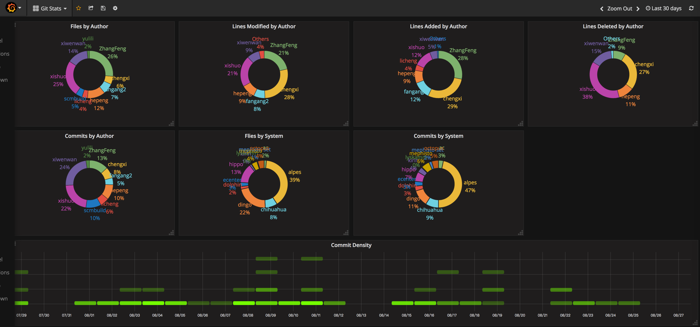

# Introduction
This is a collection of tools to load time series data into influxdb.

## Install
This project is developed and tested under Python 2.7.  The third-party
modules required by this project are listed in the *requirements.txt*
file. To install these dependencies in one go, run the following
command:

    pip install -r requirements.txt

## git stat loader usage
The loader searches configuration settings from the file at
~/.influxdemo/config.ini. Make sure you put the file at the right
directory.

An example of such config file is as follows:

    [gitstat]
    branch=origin/master
    measurement=git_stat

    [influxdb]
    user=
    password=
    host=192.168.11.20
    port=8086
    database=mydb

The basic usage of this tool is as follows:

    load_gitstat.py repo_path1 repo_path2 ...

## Git statistics visualization
After successful data load, you may visualize the git statistics using
tool like grafana. A sample dash board is included to demonstrate what
the commit data can be illustrated.

